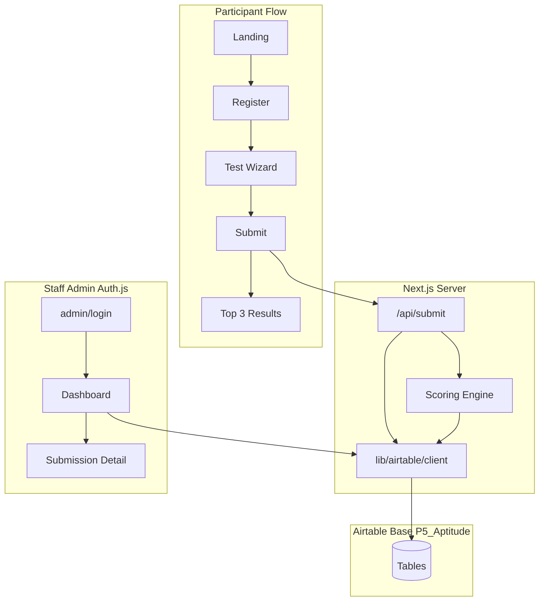
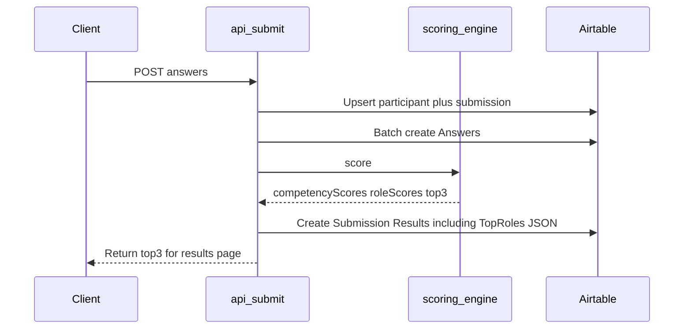

# Pillar 5 Aptitude — Integrated Implementation Plan

**Canonical spec:** [docs/superpowers/specs/2026-07-20-p5-aptitude-design.md](../../docs/superpowers/specs/2026-07-20-p5-aptitude-design.md)

**Repo:** [P5-ICT/P5-aptitude](https://github.com/P5-ICT/P5-aptitude)

This plan supersedes earlier drafts (Supabase-based plan, Airtable-only stub, and TopRoles-only addendum). All requirements live here.

---

## Stack decisions (locked)

| Concern | Choice |
|---------|--------|
| App | Next.js 15 App Router + Tailwind, Vercel |
| Data | **Airtable** — server-only `AIRTABLE_API_KEY` (never `NEXT_PUBLIC_*`) |
| Staff auth | **Auth.js** + Google OAuth, `@pillar5group.co.za` (or `STAFF_EMAIL_DOMAIN`) |
| Participants | No Airtable client access — only `POST /api/submit` |
| CSV export | Airtable native table export only — **no** custom admin CSV |
| Scoring | Pure TS in `lib/scoring/*` — store-agnostic |

**Not in scope:** Supabase, RLS, custom CSV, separate Recommended Roles table.

---

## Record cap warning

At **500 participants** × **84 answers** ≈ **44k rows** → requires **Airtable Team/Pro (50k/base)** or higher. Free/Plus insufficient. Confirm plan tier before production load.

**Write pattern:** Batch creates (10 records/request, 5 req/sec). Full submit ≈ ~9 answer batches + participant/submission/result writes — backoff in client.

---

## Architecture



---

## Airtable schema (implementation target)

Align [`lib/airtable/tables.ts`](../../lib/airtable/tables.ts) with these field names (replace outdated Slug/Prompt/Percentile schema).

| Table | Key fields |
|-------|------------|
| Role Families | RoleCode, Name, Description, ExampleRoles, OutputTemplate |
| Competencies | Code (C01–C10), Name, Definition |
| Role Competency Weights | RoleCode (link), CompetencyCode (link), Weight |
| Questions | QuestionID, Order, Section, Text, ResponseType, ScoringType, PrimaryCompetency, SecondaryCompetency, Required, Notes |
| Question Options | QuestionID (link), Key, Label, ScoreValue, MapsTo |
| Participants | ParticipantID, FullName, Email, Phone, CreatedAt |
| Submissions | SubmissionID, ParticipantID (link), Status (`in_progress` \| `completed` \| `rejected`), ConsentGiven, StartedAt, CompletedAt |
| Answers | SubmissionID (link), QuestionID (link), SelectedOptions (JSON string), CreatedAt |
| **Submission Results** | SubmissionID (link), CompetencyScores (JSON), RoleScores (JSON), **TopRoles (JSON)**, GeneratedAt |

JSON fields use long text + `JSON.stringify` / `JSON.parse`.

### TopRoles persistence (required)

Top 3 recommendations are **stored in Airtable**, not only returned to the client.

**Shape** on one Submission Results row:

- `CompetencyScores` — all competency scores
- `RoleScores` — all 12 role scores
- **`TopRoles`** — ranked array of 3: `{ roleCode, name, fitScore, reasons, gaps, nextSteps }`
- `GeneratedAt`



**Rejected (no consent):** persist answers + status `rejected`; **do not** write Submission Results / TopRoles.

**Admin:** list shows `TopRoles[0]`; detail shows full top 3 + role scores from stored JSON — no re-score on view.

**Field constants target:**

```ts
export const SUBMISSION_RESULTS_FIELDS = {
  SUBMISSION_ID: "SubmissionID",
  COMPETENCY_SCORES: "CompetencyScores",
  ROLE_SCORES: "RoleScores",
  TOP_ROLES: "TopRoles",
  GENERATED_AT: "GeneratedAt",
} as const;
```

---

## Scoring algorithm

`lib/scoring/engine.ts` + `lib/scoring/exposure-maps.ts` — no Airtable calls inside the engine.

1. **Consent (P001):** No → `rejected`, persist answers, do not score.
2. **Competency raw** (Objective + Judgement): primary 100%; secondary **50%** (UAT-tunable).
3. **Normalize:** `(raw / maxPossible) * 100`.
4. **Base role fit:** weighted sum of competency scores × role weights → 0–100.
5. **Interest (I001–I012):** +4 per mapping hit.
6. **Exposure (P003–P006):** bonuses per exposure-maps.
7. **Final:** sort → **top 3** + narrative from Role Families copy.

Workbook gaps: C10 has weights but no tagged questions → 0; C09 sparse (2 tags).

---

## Implementation phases

### Phase 1 — Foundation

1. Align `lib/airtable/tables.ts` with schema above (including `TOP_ROLES`).
2. Add `lib/airtable/rate-limit.ts` (≈200ms spacing, 5 req/sec).
3. Add `lib/airtable/client.ts` — `listRecords`, `listAllRecords`, `createRecords`, `updateRecords`; batches of 10.
4. Add `lib/auth/auth-options.ts` — Google provider, domain gate, JWT `role: staff`.
5. Add `app/api/auth/[...nextauth]/route.ts` + `middleware.ts` protecting `/admin/*` except login.
6. `.env.example`: `AIRTABLE_*`, `NEXTAUTH_*`, `GOOGLE_*`, `STAFF_EMAIL_DOMAIN`.
7. Remove any Supabase references from README/env.

### Phase 2 — Catalog + Airtable base

1. Create Airtable base **P5 Aptitude** with tables/fields above.
2. `scripts/import-workbook.ts` (exceljs): validate 84 questions, 12 roles, weights ≈1.0/role; write `lib/data/*.json`; optional `--sync-airtable`.

### Phase 3 — Scoring

1. Implement engine + exposure maps.
2. Unit tests with fixtures; mock Airtable client.
3. Assert scored output includes a top-3 array suitable for `TopRoles`.

### Phase 4 — Participant UI

1. Landing, register (name, email, optional phone), 9-section wizard, results.
2. Progress may use localStorage; Airtable is authoritative after submit.
3. Aesthetic: follow frontend-design skill (not generic dashboard look).

### Phase 5 — Submit API

1. Validate payload.
2. Upsert participant + submission.
3. Batch-write Answers.
4. Run scoring (catalog from `lib/data/*.json` or Airtable).
5. **Create Submission Results** with `TopRoles: JSON.stringify(top3)` plus competency/role maps.
6. Return same top 3 to client.
7. Test: mock `createRecords` for Submission Results asserts `TopRoles` has 3 ranked entries.

### Phase 6 — Admin

1. Auth.js login.
2. List: name, email, date, status, primary top role from Airtable `TopRoles`.
3. Detail: answers, competency breakdown, 12 role scores, full top 3 — from stored results.
4. No CSV export UI.

### Phase 7 — Deploy + UAT

1. Commit to `P5-ICT/P5-aptitude`; connect Vercel.
2. Set env vars; PAT scoped to base.
3. Run import (+ `--sync-airtable` when ready).
4. Google OAuth redirect URLs; staff domain check.
5. UAT: consent reject, happy path (verify TopRoles in Airtable), admin login, Airtable CSV export.

---

## Project structure

```
P5-aptitude/
├── app/
│   ├── page.tsx
│   ├── register/
│   ├── test/[sectionSlug]/
│   ├── results/[submissionId]/
│   ├── admin/login/, admin/, admin/submissions/[id]/
│   └── api/submit/, api/auth/[...nextauth]/
├── lib/
│   ├── airtable/client.ts, tables.ts, rate-limit.ts
│   ├── auth/auth-options.ts
│   ├── scoring/engine.ts, exposure-maps.ts
│   └── data/*.json
├── scripts/import-workbook.ts
├── middleware.ts
├── docs/superpowers/specs/2026-07-20-p5-aptitude-design.md
└── .env.example
```

---

## Build orchestration

| Role | Model |
|------|--------|
| Orchestrator / reviewer | Grok 4.5 (`cursor-grok-4.5-high`) |
| Implementation sub-agents | Composer 2.5 (`composer-2.5`) |

Workflow: Grok assigns phase slices → Composer implements → Grok reviews against this plan + design spec.

---

## Open items (confirm during build / UAT)

1. Secondary competency weight (50%) and exposure bonus scale — UAT tuning.
2. Optional employee ID on Participants.
3. Pillar 5 branding assets.
4. Airtable plan tier Team+ before production.

---

## Acceptance checklist

- [ ] Completed submit creates Submission Results with `TopRoles` parsing to exactly 3 ranked recommendations
- [ ] Results UI and admin detail use stored TopRoles (admin never depends on client-only data)
- [ ] No-consent path: answers saved, status `rejected`, no results row
- [ ] Batched writes respect Airtable rate limits
- [ ] Staff-only admin via Google domain restriction
- [ ] No Supabase / no custom CSV in product
