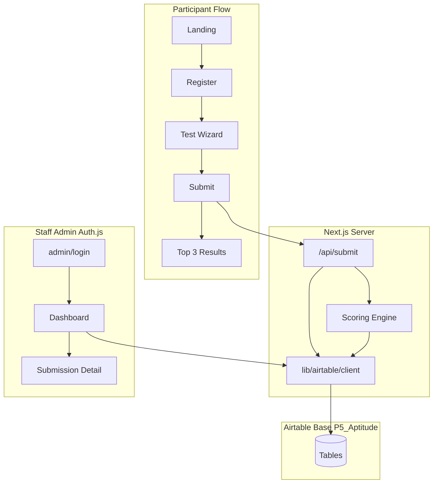

# Pillar 5 Aptitude Test Web App — Design Spec

**Last updated:** 2026-07-27  
**Status:** Awaiting review before full implementation build  
**Repo:** [P5-ICT/P5-aptitude](https://github.com/P5-ICT/P5-aptitude)

## Summary

Greenfield **Next.js 15** aptitude test for Pillar 5: participants register, complete an 84-question assessment, receive automatic scoring and **top three role-family recommendations**. Staff review submissions via a protected admin UI.

**Backend:** **Airtable** (data storage, server-side only)  
**Staff auth:** **Auth.js (NextAuth)** with Google OAuth restricted to `@pillar5group.co.za`  
**Deployment:** Vercel, connected to the P5 GitHub org

Participants never call Airtable directly. All writes go through `/api/submit` using a server-only Personal Access Token — same trust boundary as a Supabase service-role key. No RLS equivalent is required.

---

## Why Airtable + Auth.js (not Supabase)

| Concern | Approach |
|--------|----------|
| Existing P5 stack | Reuse Airtable already used by Pillar 5 |
| Participant data | Server-only PAT; no client DB access |
| Staff login | Auth.js (Airtable has no auth product) |
| CSV export | Use Airtable native per-table CSV export; **no custom CSV export in admin** |
| Rate limits | Batch writes (10 records/request, 5 req/sec per base) |

---

## Scale and Airtable plan tier (confirm before production)

**Expected volume:** 50–500 participants.

| Table | Rows at 500 participants (approx.) |
|-------|----------------------------------|
| Static catalog (roles, competencies, weights, questions, options) | ~600–900 |
| Participants | 500 |
| Submissions | 500 |
| **Answers** (1 row per question per submission) | **42,000** |
| Submission Results | 500 |
| **Total (approx.)** | **~44,000** |

Airtable per-base record limits (typical tiers):

| Tier | Records / base | Fit for this app |
|------|----------------|------------------|
| Free | 1,000 | **Insufficient** |
| Plus | 5,000 | **Insufficient** |
| Pro / Team | 50,000 | **Works at ≤~500 participants** (~6k headroom) |
| Business | 125,000+ | Comfortable headroom |

**Action required:** Confirm Pillar 5’s Airtable plan is **Team (or higher)** before loading production data. At 500 participants with one Answers row per question, you approach Pro/Team caps.

**Mitigation (future, if needed):** Store all answers for a submission as a single JSON long-text field on `Submissions` instead of 84 `Answers` rows — drops ~41.5k records but diverges from the normalized table design below.

**Write pattern:** Batch answer creates per submission (up to 10 records per API call, rate-limited to 5 req/sec). A full submission may require ~9 answer batches plus participant/submission/result writes — design `/api/submit` accordingly with backoff.

---

## Source data

Workbook: `Pillar5_Aptitude_Test_Core_Design.xlsx`

| Sheet | Content |
|-------|---------|
| Role Families | 12 pathways (AO, FA, DA, IT, MC, SC, PC, HR, BD, EN, LS, PT) |
| Weighting Matrix | C01–C10 weights per role (each row sums to 100%) |
| Questions | 84 questions, 9 sections, 7 scoring types |

| Scoring type | Count | Purpose |
|--------------|-------|---------|
| Consent | 1 | Gate — no consent = no scoring |
| Context | 1 | Profile only |
| Exposure | 4 | Prior experience / role exposure |
| Objective | 22 | Competency items |
| Judgement | 32 | Situational items |
| Self-report | 12 | Not scored |
| Interest | 12 | Career preference (+4 per role mapping) |

**Workbook gaps:** No full aggregation formula (derived below). **C10** has matrix weights but no tagged questions → score 0. **C09** is sparse (2 question tags).

---

## Architecture



---

## Airtable base schema

Base name example: **P5 Aptitude**

JSON-shaped fields use **long text** with `JSON.stringify` / `JSON.parse` (no native JSONB).

| Table | Fields |
|-------|--------|
| **Role Families** | RoleCode, Name, Description, ExampleRoles, OutputTemplate |
| **Competencies** | Code (C01–C10), Name, Definition |
| **Role Competency Weights** | RoleCode (link → Role Families), CompetencyCode (link → Competencies), Weight |
| **Questions** | QuestionID, Order, Section, Text, ResponseType, ScoringType, PrimaryCompetency, SecondaryCompetency, Required, Notes |
| **Question Options** | QuestionID (link → Questions), Key (A/B/…), Label, ScoreValue, MapsTo |
| **Participants** | ParticipantID, FullName, Email, Phone, CreatedAt |
| **Submissions** | SubmissionID, ParticipantID (link), Status (`in_progress` \| `completed` \| `rejected`), ConsentGiven, StartedAt, CompletedAt |
| **Answers** | SubmissionID (link), QuestionID (link), SelectedOptions (JSON string), CreatedAt |
| **Submission Results** | SubmissionID (link), CompetencyScores (JSON string), RoleScores (JSON string), TopRoles (JSON string), GeneratedAt |

Field name constants live in [`lib/airtable/tables.ts`](../../../lib/airtable/tables.ts).

---

## Auth.js (staff only)

- **Provider:** Google OAuth, restricted to `@pillar5group.co.za` in `signIn` callback (no Supabase Auth).
- **Session:** JWT includes `role: "staff"` for allowed domain users.
- **Routes:** `middleware` protects `/admin/*` except `/admin/login`; unauthenticated users redirect to login.
- **Config:** [`lib/auth/auth-options.ts`](../../../lib/auth/auth-options.ts)

Credentials provider can be added later if P5 standardizes on email/password elsewhere.

---

## Scoring algorithm (unchanged — store-agnostic)

Implemented in `lib/scoring/engine.ts` and `lib/scoring/exposure-maps.ts`. Pure TypeScript; no Airtable calls inside the engine.

1. **Consent (P001):** No → `rejected`, persist answers, do not score.
2. **Competency raw (Objective + Judgement):** Primary 100% of option points; secondary **50%** (default pending UAT).
3. **Normalize:** `competencyScore[C] = (raw / maxPossible) * 100` (0 if no max).
4. **Base role fit:** `Σ competencyScore[Cxx] × weight[role][Cxx]` → 0–100.
5. **Interest (I001–I012):** +4 per mapping hit.
6. **Exposure (P003–P006):** Depth/experience bonuses per derived rules in exposure-maps.
7. **Final:** `baseFit + interestBonus + exposureBonus` → sort → **top 3**.
8. **Narrative:** Fit score, reasons, gaps, next steps from Role Families copy.

---

## API routes

### `POST /api/submit`

1. Validate submission payload (participant + answers).
2. Upsert participant/submission in Airtable.
3. **Batch-write** Answers (groups of 10, rate-limited).
4. Run scoring engine (load question catalog from `lib/data/*.json` or Airtable).
5. Write Submission Results row including **TopRoles** JSON (ranked top 3 — persisted in Airtable, not client-only).
6. Return the same top roles to the client.

Participant progress may also use localStorage; authoritative store is Airtable after submit.

---

## Admin dashboard

| Feature | In scope |
|---------|----------|
| Auth.js login | Yes |
| Submissions list (name, email, date, status, top role) | Yes |
| Detail: answers, competency breakdown, 12 role scores | Yes |
| Custom CSV export | **No** — link/docs to Airtable native table export |

---

## Workbook import pipeline

Script: [`scripts/import-workbook.ts`](../../../scripts/import-workbook.ts)

1. Parse three sheets with **exceljs**.
2. Validate: 84 questions, 12 roles, weights sum to 1.0 per role, scoring keys parseable.
3. Write [`lib/data/*.json`](../../../lib/data/) (committed; runtime reference/fallback).
4. Optional `--sync-airtable`: batch-create records (10 per request, 5 req/sec backoff).

Run once locally (or one-off CI job) after base and PAT are configured.

---

## Project structure

```
P5-aptitude/
├── app/
│   ├── page.tsx
│   ├── register/
│   ├── test/[sectionSlug]/
│   ├── results/[submissionId]/
│   ├── admin/login/, admin/, admin/submissions/[id]/
│   └── api/
│       ├── submit/route.ts
│       └── auth/[...nextauth]/route.ts
├── lib/
│   ├── airtable/client.ts
│   ├── airtable/tables.ts
│   ├── airtable/rate-limit.ts
│   ├── auth/auth-options.ts
│   ├── scoring/engine.ts
│   ├── scoring/exposure-maps.ts
│   └── data/*.json
├── scripts/import-workbook.ts
├── middleware.ts
├── docs/superpowers/specs/2026-07-20-p5-aptitude-design.md
└── .env.example
```

**Removed (Supabase):** `lib/supabase/*`, `supabase/migrations/*`, RLS, Supabase env vars.

---

## Environment variables

```env
AIRTABLE_API_KEY=
AIRTABLE_BASE_ID=

NEXTAUTH_URL=
NEXTAUTH_SECRET=

GOOGLE_CLIENT_ID=
GOOGLE_CLIENT_SECRET=

# Optional: restrict staff domain (default pillar5group.co.za)
STAFF_EMAIL_DOMAIN=pillar5group.co.za
```

Never expose `AIRTABLE_API_KEY` as `NEXT_PUBLIC_*`.

---

## Deployment

1. Initial commit to `P5-ICT/P5-aptitude`.
2. Connect repo in Vercel (P5 org).
3. Create/confirm Airtable base **P5 Aptitude**; PAT scoped to that base only.
4. Set Vercel env vars (above).
5. Run `npm run import-workbook` (and `--sync-airtable` when ready).
6. Configure Google OAuth consent + redirect URLs for production/preview.
7. Confirm staff domain restriction; preview on PR, production on `main`.

---

## Testing strategy

| Area | Approach |
|------|----------|
| Scoring engine | Unit tests with fixtures; **mock** `lib/airtable/client.ts` |
| Import script | Validation test: 84 questions, parseable keys |
| Airtable writes | Integration or manual: full submission batched within rate limits |
| UAT | Consent reject, happy path, admin login, Airtable CSV export |
| Edge cases | Multi-select (P004, P006), resume in_progress, C10/C09 sparse |

---

## Implementation phases

| Phase | Deliverable |
|-------|-------------|
| 1 — Foundation | Next.js 15 + Tailwind, Airtable client, Auth.js, import script, JSON seed |
| 2 — Scoring | `engine.ts`, exposure maps, unit tests |
| 3 — Participant UI | Landing, register, section wizard, results |
| 4 — Submit API | Batched Airtable persistence + scoring |
| 5 — Admin | Dashboard + detail (no CSV export) |
| 6 — Deploy | Vercel + Airtable + Google OAuth |

---

## Build orchestration (after plan approval)

When implementation starts:

| Role | Model | Responsibility |
|------|--------|----------------|
| **Orchestrator / reviewer** | **Grok 4.5** (`cursor-grok-4.5-high`) | Task breakdown, cross-cutting review, architecture consistency, rate-limit and record-cap checks |
| **Implementing sub-agents** | **Composer 2.5** (`composer-2.5`) | Focused implementation slices (import script, scoring tests, UI sections, API routes) |

Workflow: Grok assigns slices → Composer implements → Grok reviews diffs against this spec before merge.

---

## Open items (confirm before build)

1. Secondary competency weight (50%) and exposure bonus scale — UAT tuning.
2. Participant fields: name + email + optional phone — add employee ID?
3. Pillar 5 branding assets (logo, colors).
4. **Airtable plan tier** — Team or higher for 500-participant ceiling.

---

## Scaffold status (2026-07-27)

| Item | Status |
|------|--------|
| This design spec (Airtable + Auth.js) | **Done** |
| [`.cursor/plans/p5-aptitude-implementation.plan.md`](../../../.cursor/plans/p5-aptitude-implementation.plan.md) | **Done** |
| Next.js 15 scaffold + Tailwind | **Done** |
| `lib/airtable/client.ts`, `rate-limit.ts`, aligned `tables.ts` | **Done** |
| `lib/auth/auth-options.ts` + `app/api/auth/[...nextauth]/route.ts` | **Done** |
| `scripts/import-workbook.ts` + seed data (`lib/data/*.json`) | **Done** |
| Scoring engine + unit tests | **Done** |
| Participant UI (landing, register, test wizard, results) | **Done** |
| `POST /api/submit` with TopRoles persistence | **Done** |
| Admin dashboard + detail (reads TopRoles from Airtable) | **Done** |
| `vercel.json`, `.env.example`, `docs/airtable-base-setup.md` | **Done** |

**Note:** Existing [`lib/airtable/tables.ts`](../../../lib/airtable/tables.ts) uses an older field schema (e.g. `Slug`, `Prompt`). Replace with constants matching the [Airtable base schema](#airtable-base-schema) on first implementation commit.

### First implementation commit checklist

1. Align `lib/airtable/tables.ts` with spec field names.
2. Add `lib/airtable/rate-limit.ts` (200ms spacing, 5 req/sec).
3. Add `lib/airtable/client.ts` — `listRecords`, `listAllRecords`, `createRecords`, `updateRecords` via REST; batches of 10.
4. Add `lib/auth/auth-options.ts` — Google provider, `STAFF_EMAIL_DOMAIN`, JWT `role: staff`.
5. Add `scripts/import-workbook.ts` — validate 84/12/weights; write `lib/data/*.json`; optional Airtable sync.
6. Remove any Supabase references from README and env templates.
